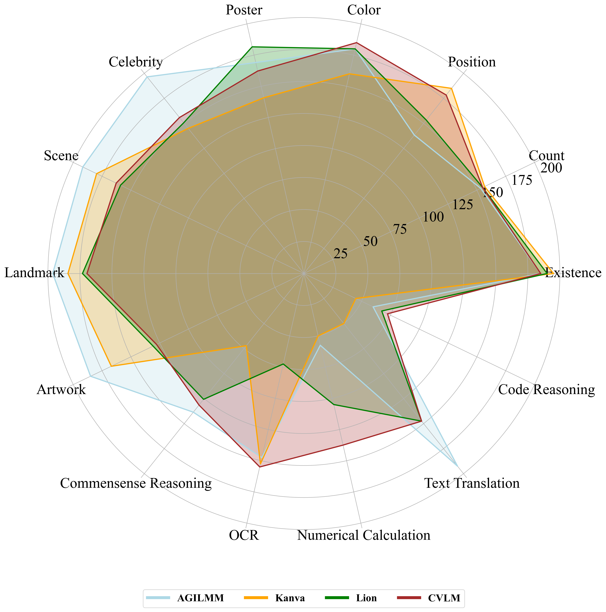

# MME: A Comprehensive Evaluation Benchmark for Multimodal Large Language Models


> Multimodal Large Language Model (MLLM) relies on the powerful LLM to perform multimodal tasks, showing amazing emergent abilities in recent studies, such as writing poems based on an image. However, it is difficult for these case studies to fully reflect the performance of MLLM, lacking a comprehensive evaluation. In this paper, we fill in this blank, presenting the first MLLM Evaluation benchmark MME. It measures both perception and cognition abilities on a total of 14 subtasks. In order to avoid data leakage that may arise from direct use of public datasets for evaluation, the annotations of instruction-answer pairs are all manually designed. The concise instruction design allows us to fairly compare MLLMs, instead of struggling in prompt engineering. Besides, with such an instruction, we can also easily carry out quantitative statistics. A total of 44 advanced MLLMs are comprehensively evaluated on our MME, which not only suggests that existing MLLMs still have a large room for improvement, but also reveals the potential directions for the subsequent model optimization.


## Our MLLM works

🔥🔥🔥 **A Survey on Multimodal Large Language Models**  
**[Project Page](https://github.com/BradyFU/Awesome-Multimodal-Large-Language-Models)** | **[Paper](https://arxiv.org/pdf/2306.13549.pdf)**

The first survey for Multimodal Large Language Models (MLLMs). :sparkles: 

Welcome to add WeChat ID (wmd_ustc) to join our MLLM communication group! :star2:

---

🔥🔥🔥 **MME: A Comprehensive Evaluation Benchmark for Multimodal Large Language Models**  
**[Project Page [This Page]](https://github.com/BradyFU/Awesome-Multimodal-Large-Language-Models/tree/Evaluation)** | **[Paper](https://arxiv.org/pdf/2306.13394.pdf)**

The first comprehensive evaluation benchmark for MLLMs. Now the leaderboards include **44** advanced models, such as Gemini Pro and GPT-4V. :sparkles:

If you want to add your model in our leaderboards, please feel free to email bradyfu24@gmail.com. We will update the leaderboards in time. :sparkles:

<details><summary>Download MME :star2::star2: </summary>

The benchmark dataset is collected by Xiamen University for academic research only. You can email yongdongluo@stu.xmu.edu.cn to obtain the dataset, according to the following requirement. 

**Requirement**: A real-name system is encouraged for better academic communication. Your email suffix needs to match your affiliation, such as xx@stu.xmu.edu.cn and Xiamen University. Otherwise, you need to explain why. Please include the information bellow when sending your application email.

```
Name: (tell us who you are.)
Affiliation: (the name/url of your university or company)
Job Title: (e.g., professor, PhD, and researcher)
Email: (your email address)
How to use: (only for non-commercial use)
```

</details>

---

🔥🔥🔥 **Woodpecker: Hallucination Correction for Multimodal Large Language Models**  
**[Paper](https://arxiv.org/pdf/2310.16045.pdf)** | **[Online Demo](https://d810a2cbf06856cc91.gradio.live/)** | **[Source Code](https://github.com/BradyFU/Woodpecker)**

The first work to correct hallucinations in MLLMs. :sparkles:

---

🔥🔥🔥 **A Challenger to GPT-4V? Early Explorations of Gemini in Visual Expertise**  
<p align="center">
    
</p>  

<font size=7><div align='center'> :apple: \[[Read our arXiv Paper](https://arxiv.org/pdf/2312.12436.pdf)\] </div></font>

<div align='center'> The first technical report for <b>Gemini vs GPT-4V</b>. A total of <b>128 pages</b>. :sparkles: </div>  
<div align='center'> Completed within one week of the Gemini API opening. :star2: </div>

---

<br> **📑 If you find our projects helpful to your research, please consider citing:** <br>
```
@article{yin2023survey,
  title={A Survey on Multimodal Large Language Models},
  author={Yin, Shukang and Fu, Chaoyou and Zhao, Sirui and Li, Ke and Sun, Xing and Xu, Tong and Chen, Enhong},
  journal={arXiv preprint arXiv:2306.13549},
  year={2023}
}

@article{fu2023mme,
  title={MME: A Comprehensive Evaluation Benchmark for Multimodal Large Language Models},
  author={Fu, Chaoyou and Chen, Peixian and Shen, Yunhang and Qin, Yulei and Zhang, Mengdan and Lin, Xu and Yang, Jinrui and Zheng, Xiawu and Li, Ke and Sun, Xing and Wu, Yunsheng and Ji, Rongrong},
  journal={arXiv preprint arXiv:2306.13394},
  year={2023}
}

@article{yin2023woodpecker,
  title={Woodpecker: Hallucination Correction for Multimodal Large Language Models},
  author={Yin, Shukang and Fu, Chaoyou and Zhao, Sirui and Xu, Tong and Wang, Hao and Sui, Dianbo and Shen, Yunhang and Li, Ke and Sun, Xing and Chen, Enhong},
  journal={arXiv preprint arXiv:2310.16045},
  year={2023}
}

@article{fu2023gemini,
  title={A Challenger to GPT-4V? Early Explorations of Gemini in Visual Expertise},
  author={Fu, Chaoyou and Zhang, Renrui and Wang, Zihan and Huang, Yubo and Zhang, Zhengye and Qiu, Longtian and Ye, Gaoxiang and Shen, Yunhang and Zhang, Mengdan and Chen, Peixian and Zhao, Sirui and Lin, Shaohui and Jiang, Deqiang and Yin, Di and Gao, Peng and Li, Ke and Li, Hongsheng and Sun, Xing},
  journal={arXiv preprint arXiv:2312.12436},
  year={2023}
}
```

---

# News 🚀
<details><summary> <b>2023</b> </summary>

**[2023-12]** 

1. [12-31] Thanks to [**Dian Li**](https://scholar.google.com/citations?hl=zh-CN&user=rF7HU94AAAAJ), [**PureMM**](https://github.com/Q-MM/PureMM) takes part in our leaderboards. 
2. [12-31] Thanks to Yilin Ma and [**Min Xu**](http://faculty.dlut.edu.cn/minxu/zh_CN/index.htm), [**RBDash**](https://github.com/RBDash-Team/RBDash) is added in MME. 
3. [12-18] Thanks to [**Zihan Wang**](https://github.com/hanhanHANS), our leaderboards usher in [**Gemini Pro**](https://storage.googleapis.com/deepmind-media/gemini/gemini_1_report.pdf).
4. [12-18] Thanks to [**Jinze Bai**](https://github.com/jinze1994), a new model [**Qwen-VL-Plus**](https://help.aliyun.com/zh/dashscope/developer-reference/vl-plus-quick-start) is added in MME.
5. [12-18] Thanks to [**Junbum Cha**](https://scholar.google.com.hk/citations?user=Py2gKnAAAAAJ&hl=zh-CN&oi=ao), [**Honeybee**](https://arxiv.org/pdf/2312.06742.pdf) joins our leaderboards.
6. [12-12] Thanks to [**Yuliang Liu**](https://github.com/Yuliang-Liu), [**Monkey-Chat**](https://github.com/Yuliang-Liu/Monkey) takes part in MME. 
7. [12-12] Thanks to [**Junkun Yuan**](https://scholar.google.com.hk/citations?hl=zh-CN&user=j3iFVPsAAAAJ&view_op=list_works&sortby=pubdate), we welcome a new member [**AGILMM**](https://github.com/AIResearchEnthusiast/AGILMM). 
8. [12-01] Thanks to [**Cheng Wen**](https://scholar.google.com/citations?user=9MLB3s8AAAAJ&hl=zh-CN), [**BELLE-VL**](https://huggingface.co/BELLE-2/BELLE-VL) is added to our leaderboards. 
9. [12-01] Thanks to [**PCI Research**](https://www.pcitech.com/), [**TransCore-M**](https://github.com/PCIResearch/TransCore-M) joins MME. 


**[2023-11]** 

1. [11-24] Thanks to [**Xiaoyi Dong**](https://scholar.google.com/citations?user=FscToE0AAAAJ&hl=en), we add [**ShareGPT4V**](https://github.com/InternLM/InternLM-XComposer/tree/main/projects/ShareGPT4V) to our leaderboards. 
2. [11-24] Thanks to [**Muyang He**](https://scholar.google.com/citations?hl=en&user=Q0Xn7i4AAAAJ), [**DataOptim**](https://github.com/BAAI-DCAI/DataOptim) joins MME. 
3. [11-24] Thanks to [**Zifei Shan**](https://scholar.google.com/citations?user=DGIdpTwAAAAJ&hl=en&oi=ao), [**Kanva**](https://github.com/llp1992/Kanva) is added. 
4. [11-21] Thanks to [**Junke Wang**](https://scholar.google.com.hk/citations?user=qQuxuo0AAAAJ&hl=zh-CN&oi=ao), [**LVIS-INSTRUCT4V**](https://arxiv.org/pdf/2311.07574.pdf) is added to our MME.
5. [11-18] Thanks to [**Zhenbo Luo**](https://dblp.org/pid/152/8206.html), our leaderboards welcome a new member [**CVLM**](https://github.com/buptlihang/CVLM).
6. [11-10] Thanks to [**Qinghao Ye**](https://scholar.google.com.hk/citations?user=ZYOhaGwAAAAJ&hl=zh-CN&oi=ao), we get a new model [**mPLUG-Owl2**](https://github.com/X-PLUG/mPLUG-Owl/tree/main/mPLUG-Owl2) in our leaderboards.
7. [11-10] Thanks to [**Zhibin Wang**](https://scholar.google.com/citations?hl=zh-CN&user=YHzKee8AAAAJ), [**InfMLLM**](https://github.com/mightyzau/InfMLLM) joins our leaderboards (update in 2023-12-12).

**[2023-10]** 

1. [10-29] Thanks to [**Jiaming Han**](https://scholar.google.com/citations?hl=en&user=vgcxKEcAAAAJ&view_op=list_works), [**SPHINX**](https://github.com/Alpha-VLLM/LLaMA2-Accessory/tree/main/SPHINX) is added to our leaderboards. 
2. [10-23] Thanks to [**Zihan Wang**](https://github.com/hanhanHANS), he manually evaluate the performance of [**GPT-4V**](https://cdn.openai.com/papers/GPTV_System_Card.pdf) on our benchmark. Note that GPT-4V refuses to answer questions that involve individuals, resulting in a zero score in the Celebrity subtask. 
3. [10-13] Thanks to [**Yizhou Zhou**](https://scholar.google.com/citations?user=dHBNmSkAAAAJ&hl=en&oi=sra), [**WeMM**](https://github.com/scenarios/WeMM) joins our leaderboards (The results are renewed on 2023-11-10 by updating the model). 
4. [10-13] Thanks to [**Cui Junbo**](https://github.com/thunlp/Muffin), we add [**Muffin**](https://github.com/thunlp/Muffin) to our leaderboards. 
5. [10-13] Thanks to [**Jiaming Han**](https://scholar.google.com/citations?hl=en&user=vgcxKEcAAAAJ&view_op=list_works), the results of [**LLaMA-Adapter V2**](https://github.com/OpenGVLab/LLaMA-Adapter) have been updated. 
6. [10-04] Thanks to [**Haotian Liu**](https://hliu.cc/), the results of [**LLaVA**](https://github.com/haotian-liu/LLaVA) have been updated. 

**[2023-09]** 

1. [09-28] Thanks to [**Huasong Zhong**](https://github.com/mynameischaos), [**Lion**](https://github.com/mynameischaos/Lion) is added.
2. [09-27] Thanks to [**Xiaoyi Dong**](https://scholar.google.com/citations?user=FscToE0AAAAJ&hl=en), [**InternLM-XComposer-VL**](https://github.com/InternLM/InternLM-XComposer) joins our leaderboards.
3. [09-05] Thanks to [**Jinze Bai**](https://github.com/jinze1994), our leaderboards usher in [**Qwen-VL-Chat**](https://github.com/QwenLM/Qwen-VL).
4. [09-01] Thanks to [**Skywork Multi-Modal Group**](https://github.com/will-singularity), [**Skywork-MM**](https://github.com/will-singularity/Skywork-MM/tree/main) takes part in our leaderboards.

**[2023-08]** 

1. [08-28] Thanks to [**UCSD MLPC**](https://github.com/mlpc-ucsd), we welcome [**BLIVA**](https://github.com/mlpc-ucsd/BLIVA) to join our leaderboards. 
2. [08-28] Thanks to [**Jianfeng Wang**](https://scholar.google.com.hk/citations?user=vJWEw_8AAAAJ&hl=zh-CN&oi=sra), [**GIT2**](https://github.com/microsoft/GenerativeImage2Text) is added to our leaderboards. 
3. [08-28] Thanks to [**Yike Yuan**](https://github.com/yyk-wew) and [**Songyang Zhang**](https://github.com/tonysy), the results of [**MiniGPT4**](https://arxiv.org/pdf/2304.10592.pdf) have been revised. 
4. [08-21] Thanks to [**Haozhe Zhao**](https://github.com/HaozheZhao), [**MMICL**](https://github.com/HaozheZhao/MIC) joins our leaderboards (The results are renewed on 2023-09-17 by upgrading the checkpoint.). 
5. [08-13] Thanks to [**Zhejiang University DCD Lab**](https://github.com/DCDmllm), our leaderboards incorporate a new member [**Cheetor**](https://github.com/DCDmllm/Cheetah). 
6. [08-08] Thanks to [**Fuxiao Liu**](https://github.com/FuxiaoLiu), we add [**LRV-Instruction**](https://github.com/FuxiaoLiu/LRV-Instruction) to our leaderboards. 

**[2023-07]** 

1. [07-28] Thanks to [**Yingzi Ma**](https://gray311.github.io/), his work [**Octopus**](https://github.com/gray311/UnifiedMultimodalInstructionTuning) has been updated to our leaderboards.
2. [07-15] Thanks to [**Jiani Zheng**](https://github.com/Garlicisnotmyfavor), our leaderboards welcome a new member [**Lynx**](https://github.com/bytedance/lynx-llm).
3. [07-12] Thanks to [**Ao Zhang**](https://github.com/waxnkw), his work [**VPGTrans**](https://github.com/VPGTrans/VPGTrans) has been added in our leaderboards.
4. [07-09] Thanks to [**Bo Li**](https://github.com/Luodian), we have updated the evaluation of his work [**Otter**](https://github.com/Luodian/Otter). It uses the latest model [**OTTER-Image-MPT7B**](https://huggingface.co/luodian/OTTER-Image-MPT7B) that incoporates OpenFlamingv2 and enhances instruction following ability.

**[2023-06]** 

1. [06-30] Thanks to [**Renrui Zhang**](https://github.com/ZrrSkywalker), we have updated the evaluation of his two works, i.e., [**LLaMA-Adapter V2**](https://github.com/OpenGVLab/LLaMA-Adapter) and [**ImageBind_LLM**](https://github.com/OpenGVLab/LLaMA-Adapter/tree/main/imagebind_LLM). The former is re-evaluated after changing the model [**weights**](https://github.com/OpenGVLab/LLaMA-Adapter/releases/download/v.2.0.0/7fa55208379faf2dd862565284101b0e4a2a72114d6490a95e432cf9d9b6c813_BIAS-7B.pth), and the latter is a newly added MLLM.
2. [06-30] Thanks to [**Gen Luo**](https://github.com/luogen1996), we have added the evaluation of his work [**LaVIN**](https://github.com/luogen1996/LaVIN).
3. [06-30] The results of other models have also been updated, retrieving the answer from the beginning of the generated responses instead of the whole responses. [**An automated evaluation script**](https://github.com/BradyFU/Awesome-Multimodal-Large-Language-Models/blob/Evaluation/tools/eval_tool.zip) for the calculation of scores has been released!

</details>

---

# Results of Unavailable Models [[Available Version](https://github.com/BradyFU/Awesome-Multimodal-Large-Language-Models/tree/Evaluation)]



# Leaderboards of Unavailable Models [[Available Version](https://github.com/BradyFU/Awesome-Multimodal-Large-Language-Models/tree/Evaluation)]


---

- [Perception](#perception)
  - [Existence](#existence) | [Count](#count) | [Position](#position) | [Color](#color) | [Poster](#poster) | [Celebrity](#celebrity) | [Scene](#scene) | [Landmark](#landmark) | [Artwork](#artwork) | [OCR](#ocr)
- [Cognition](#cognition)
  - [Commonsense Reasoning](#commonsense-reasoning) | [Numerical Calculation](#numerical-calculation) | [Text Translation](#text-translation) | [Code Reasoning](#code-reasoning)

---

## Perception

Sum of the scores of all perception subtasks, including existence, count, position, color, poster, celebrity, scene, landmark, artwork, and OCR. The full score of each subtask is 200, and that of all perception is 2000.

| Rank |                            Model                             |                           Version                            |    Score    |
| :--: | :----------------------------------------------------------: | :----------------------------------------------------------: | :---------: |
|  🏅️   | **[AGILMM](https://github.com/AIResearchEnthusiast/AGILMM)** | **[Bloom-7B](https://github.com/AIResearchEnthusiast/AGILMM)** | **1742.68** |
|  🥈   |        **[Kanva](https://github.com/llp1992/Kanva)**         |       **[Qwen-14B](https://github.com/llp1992/Kanva)**       | **1666.08** |
|  🥉   |        **[CVLM](https://github.com/buptlihang/CVLM)**        |     **[Vicuna-13B](https://github.com/buptlihang/CVLM)**     | **1636.45** |
|  4   |        [Lion](https://github.com/mynameischaos/Lion)         |     [InternLM-7B](https://github.com/mynameischaos/Lion)     |   1545.80   |
|  5   | [Skywork-MM](https://github.com/will-singularity/Skywork-MM/tree/main) | [Skywork-MM-13B](https://github.com/will-singularity/Skywork-MM/tree/main) |   1419.08   |
|  6   | [Octopus](https://github.com/gray311/UnifiedMultimodalInstructionTuning) | [MPT7B](https://github.com/gray311/UnifiedMultimodalInstructionTuning) |   1095.75   |

### Existence

| Rank |                            Model                             |                           Version                            |   Score    |
| :--: | :----------------------------------------------------------: | :----------------------------------------------------------: | :--------: |
|  🏅️   |        **[Kanva](https://github.com/llp1992/Kanva)**         |       **[Qwen-14B](https://github.com/llp1992/Kanva)**       | **195.00** |
|  🏅️   |      **[Lion](https://github.com/mynameischaos/Lion)**       |   **[InternLM-7B](https://github.com/mynameischaos/Lion)**   | **190.00** |
|  🥈   |        **[CVLM](https://github.com/buptlihang/CVLM)**        |     **[Vicuna-13B](https://github.com/buptlihang/CVLM)**     | **185.00** |
|  🥈   | **[AGILMM](https://github.com/AIResearchEnthusiast/AGILMM)** | **[Bloom-7B](https://github.com/AIResearchEnthusiast/AGILMM)** | **185.00** |
|  🥉   | **[Octopus](https://github.com/gray311/UnifiedMultimodalInstructionTuning)** | **[MPT7B](https://github.com/gray311/UnifiedMultimodalInstructionTuning)** | **180.00** |
|  🥉   | **[Skywork-MM](https://github.com/will-singularity/Skywork-MM/tree/main)** | **[Skywork-MM-13B](https://github.com/will-singularity/Skywork-MM/tree/main)** | **180.00** |

### Count

| Rank |                            Model                             |                           Version                            |   Score    |
| :--: | :----------------------------------------------------------: | :----------------------------------------------------------: | :--------: |
|  🏅️   |        **[Kanva](https://github.com/llp1992/Kanva)**         |       **[Qwen-14B](https://github.com/llp1992/Kanva)**       | **156.67** |
|  🥈   |      **[Lion](https://github.com/mynameischaos/Lion)**       |   **[InternLM-7B](https://github.com/mynameischaos/Lion)**   | **155.00** |
|  🥈   |        **[CVLM](https://github.com/buptlihang/CVLM)**        |     **[Vicuna-13B](https://github.com/buptlihang/CVLM)**     | **155.00** |
|  🥉   | **[AGILMM](https://github.com/AIResearchEnthusiast/AGILMM)** | **[Bloom-7B](https://github.com/AIResearchEnthusiast/AGILMM)** | **153.33** |
|  4   | [Skywork-MM](https://github.com/will-singularity/Skywork-MM/tree/main) | [Skywork-MM-13B](https://github.com/will-singularity/Skywork-MM/tree/main) |   151.67   |
|  5   | [Octopus](https://github.com/gray311/UnifiedMultimodalInstructionTuning) | [MPT7B](https://github.com/gray311/UnifiedMultimodalInstructionTuning) |   53.33    |

### Position

| Rank |                            Model                             |                           Version                            |   Score    |
| :--: | :----------------------------------------------------------: | :----------------------------------------------------------: | :--------: |
|  🏅️   |        **[Kanva](https://github.com/llp1992/Kanva)**         |       **[Qwen-14B](https://github.com/llp1992/Kanva)**       | **185.00** |
|  🥈   |        **[CVLM](https://github.com/buptlihang/CVLM)**        |     **[Vicuna-13B](https://github.com/buptlihang/CVLM)**     | **178.33** |
|  🥉   |      **[Lion](https://github.com/mynameischaos/Lion)**       |   **[InternLM-7B](https://github.com/mynameischaos/Lion)**   | **153.33** |
|  4   |   [AGILMM](https://github.com/AIResearchEnthusiast/AGILMM)   |  [Bloom-7B](https://github.com/AIResearchEnthusiast/AGILMM)  |   138.33   |
|  5   | [Skywork-MM](https://github.com/will-singularity/Skywork-MM/tree/main) | [Skywork-MM-13B](https://github.com/will-singularity/Skywork-MM/tree/main) |   63.33    |
|  6   | [Octopus](https://github.com/gray311/UnifiedMultimodalInstructionTuning) | [MPT7B](https://github.com/gray311/UnifiedMultimodalInstructionTuning) |   48.33    |

### Color

| Rank |                            Model                             |                           Version                            |   Score    |
| :--: | :----------------------------------------------------------: | :----------------------------------------------------------: | :--------: |
|  🏅️   |        **[CVLM](https://github.com/buptlihang/CVLM)**        |     **[Vicuna-13B](https://github.com/buptlihang/CVLM)**     | **185.00** |
|  🥈   |      **[Lion](https://github.com/mynameischaos/Lion)**       |   **[InternLM-7B](https://github.com/mynameischaos/Lion)**   | **180.00** |
|  🥈   | **[AGILMM](https://github.com/AIResearchEnthusiast/AGILMM)** | **[Bloom-7B](https://github.com/AIResearchEnthusiast/AGILMM)** | **180.00** |
|  🥉   |        **[Kanva](https://github.com/llp1992/Kanva)**         |       **[Qwen-14B](https://github.com/llp1992/Kanva)**       | **160.00** |
|  5   | [Skywork-MM](https://github.com/will-singularity/Skywork-MM/tree/main) | [Skywork-MM-13B](https://github.com/will-singularity/Skywork-MM/tree/main) |   145.00   |
|  6   | [Octopus](https://github.com/gray311/UnifiedMultimodalInstructionTuning) | [MPT7B](https://github.com/gray311/UnifiedMultimodalInstructionTuning) |   103.33   |

### Poster

| Rank |                            Model                             |                           Version                            |   Score    |
| :--: | :----------------------------------------------------------: | :----------------------------------------------------------: | :--------: |
|  🏅️   |      **[Lion](https://github.com/mynameischaos/Lion)**       |   **[InternLM-7B](https://github.com/mynameischaos/Lion)**   | **181.63** |
|  🥈   | **[Skywork-MM](https://github.com/will-singularity/Skywork-MM/tree/main)** | **[Skywork-MM-13B](https://github.com/will-singularity/Skywork-MM/tree/main)** | **175.85** |
|  🥉   | **[AGILMM](https://github.com/AIResearchEnthusiast/AGILMM)** | **[Bloom-7B](https://github.com/AIResearchEnthusiast/AGILMM)** | **169.05** |
|  4   |          [CVLM](https://github.com/buptlihang/CVLM)          |       [Vicuna-13B](https://github.com/buptlihang/CVLM)       |   162.24   |
|  5   |          [Kanva](https://github.com/llp1992/Kanva)           |         [Qwen-14B](https://github.com/llp1992/Kanva)         |   140.82   |
|  6   | [Octopus](https://github.com/gray311/UnifiedMultimodalInstructionTuning) | [MPT7B](https://github.com/gray311/UnifiedMultimodalInstructionTuning) |   138.10   |

### Celebrity

| Rank |                            Model                             |                           Version                            |   Score    |
| :--: | :----------------------------------------------------------: | :----------------------------------------------------------: | :--------: |
|  🏅️   | **[AGILMM](https://github.com/AIResearchEnthusiast/AGILMM)** | **[Bloom-7B](https://github.com/AIResearchEnthusiast/AGILMM)** | **196.47** |
|  🥈   | **[Skywork-MM](https://github.com/will-singularity/Skywork-MM/tree/main)** | **[Skywork-MM-13B](https://github.com/will-singularity/Skywork-MM/tree/main)** | **160.29** |
|  🥉   |        **[CVLM](https://github.com/buptlihang/CVLM)**        |     **[Vicuna-13B](https://github.com/buptlihang/CVLM)**     | **155.88** |
|  4   |        [Lion](https://github.com/mynameischaos/Lion)         |     [InternLM-7B](https://github.com/mynameischaos/Lion)     |   150.59   |
|  5   |          [Kanva](https://github.com/llp1992/Kanva)           |         [Qwen-14B](https://github.com/llp1992/Kanva)         |   145.00   |
|  6   | [Octopus](https://github.com/gray311/UnifiedMultimodalInstructionTuning) | [MPT7B](https://github.com/gray311/UnifiedMultimodalInstructionTuning) |   129.41   |

### Scene

| Rank |                            Model                             |                           Version                            | Score  |
| :--: | :----------------------------------------------------------: | :----------------------------------------------------------: | :----: |
|  🏅️   |   [AGILMM](https://github.com/AIResearchEnthusiast/AGILMM)   |  [Bloom-7B](https://github.com/AIResearchEnthusiast/AGILMM)  | 191.75 |
|  🥈   |          [Kanva](https://github.com/llp1992/Kanva)           |         [Qwen-14B](https://github.com/llp1992/Kanva)         | 179.75 |
|  🥉   |          [CVLM](https://github.com/buptlihang/CVLM)          |       [Vicuna-13B](https://github.com/buptlihang/CVLM)       | 162.75 |
|  4   |        [Lion](https://github.com/mynameischaos/Lion)         |     [InternLM-7B](https://github.com/mynameischaos/Lion)     | 159.00 |
|  5   | [Octopus](https://github.com/gray311/UnifiedMultimodalInstructionTuning) | [MPT7B](https://github.com/gray311/UnifiedMultimodalInstructionTuning) | 157.25 |
|  6   | [Skywork-MM](https://github.com/will-singularity/Skywork-MM/tree/main) | [Skywork-MM-13B](https://github.com/will-singularity/Skywork-MM/tree/main) | 138.89 |

### Landmark

| Rank |                            Model                             |                           Version                            |   Score    |
| :--: | :----------------------------------------------------------: | :----------------------------------------------------------: | :--------: |
|  🏅️   | **[AGILMM](https://github.com/AIResearchEnthusiast/AGILMM)** | **[Bloom-7B](https://github.com/AIResearchEnthusiast/AGILMM)** | **196.25** |
|  🥈   |        **[Kanva](https://github.com/llp1992/Kanva)**         |       **[Qwen-14B](https://github.com/llp1992/Kanva)**       | **184.34** |
|  🥉   |      **[Lion](https://github.com/mynameischaos/Lion)**       |   **[InternLM-7B](https://github.com/mynameischaos/Lion)**   | **173.00** |
|  4   |          [CVLM](https://github.com/buptlihang/CVLM)          |       [Vicuna-13B](https://github.com/buptlihang/CVLM)       |   169.50   |
|  5   | [Skywork-MM](https://github.com/will-singularity/Skywork-MM/tree/main) | [Skywork-MM-13B](https://github.com/will-singularity/Skywork-MM/tree/main) |   127.04   |
|  6   | [Octopus](https://github.com/gray311/UnifiedMultimodalInstructionTuning) | [MPT7B](https://github.com/gray311/UnifiedMultimodalInstructionTuning) |   126.00   |

### Artwork

| Rank |                            Model                             |                           Version                            |   Score    |
| :--: | :----------------------------------------------------------: | :----------------------------------------------------------: | :--------: |
|  🏅️   | **[AGILMM](https://github.com/AIResearchEnthusiast/AGILMM)** | **[Bloom-7B](https://github.com/AIResearchEnthusiast/AGILMM)** | **185.00** |
|  🥈   |        **[Kanva](https://github.com/llp1992/Kanva)**         |       **[Qwen-14B](https://github.com/llp1992/Kanva)**       | **167.00** |
|  🥉   |      **[Lion](https://github.com/mynameischaos/Lion)**       |   **[InternLM-7B](https://github.com/mynameischaos/Lion)**   | **130.75** |
|  4   |          [CVLM](https://github.com/buptlihang/CVLM)          |       [Vicuna-13B](https://github.com/buptlihang/CVLM)       |   127.75   |
|  5   | [Skywork-MM](https://github.com/will-singularity/Skywork-MM/tree/main) | [Skywork-MM-13B](https://github.com/will-singularity/Skywork-MM/tree/main) |   114.51   |
|  6   | [Octopus](https://github.com/gray311/UnifiedMultimodalInstructionTuning) | [MPT7B](https://github.com/gray311/UnifiedMultimodalInstructionTuning) |   95.00    |

### OCR

| Rank |                            Model                             |                           Version                            |   Score    |
| :--: | :----------------------------------------------------------: | :----------------------------------------------------------: | :--------: |
|  🏅️   | **[Skywork-MM](https://github.com/will-singularity/Skywork-MM/tree/main)** | **[Skywork-MM-13B](https://github.com/will-singularity/Skywork-MM/tree/main)** | **162.50** |
|  🥈   |        **[CVLM](https://github.com/buptlihang/CVLM)**        |     **[Vicuna-13B](https://github.com/buptlihang/CVLM)**     | **155.00** |
|  🥉   |        **[Kanva](https://github.com/llp1992/Kanva)**         |       **[Qwen-14B](https://github.com/llp1992/Kanva)**       | **152.50** |
|  4   |   [AGILMM](https://github.com/AIResearchEnthusiast/AGILMM)   |  [Bloom-7B](https://github.com/AIResearchEnthusiast/AGILMM)  |   147.50   |
|  5   |        [Lion](https://github.com/mynameischaos/Lion)         |     [InternLM-7B](https://github.com/mynameischaos/Lion)     |   72.50    |
|  6   | [Octopus](https://github.com/gray311/UnifiedMultimodalInstructionTuning) | [MPT7B](https://github.com/gray311/UnifiedMultimodalInstructionTuning) |   65.00    |

## Cognition

Sum of the scores of all cognition subtasks, including commonsense reasoning, numerical calculation, text translation, and code reasoning. The full score of each subtask is 200, and that of all cognition is 800.

| Rank |                            Model                             |                           Version                            |   Score    |
| :--: | :----------------------------------------------------------: | :----------------------------------------------------------: | :--------: |
|  🏅️   |        **[CVLM](https://github.com/buptlihang/CVLM)**        |     **[Vicuna-13B](https://github.com/buptlihang/CVLM)**     | **488.93** |
|  🥈   | **[AGILMM](https://github.com/AIResearchEnthusiast/AGILMM)** | **[Bloom-7B](https://github.com/AIResearchEnthusiast/AGILMM)** | **448.57** |
|  🥉   |      **[Lion](https://github.com/mynameischaos/Lion)**       |   **[InternLM-7B](https://github.com/mynameischaos/Lion)**   | **445.71** |
|  4   | [Skywork-MM](https://github.com/will-singularity/Skywork-MM/tree/main) | [Skywork-MM-13B](https://github.com/will-singularity/Skywork-MM/tree/main) |   356.43   |
|  5   | [Octopus](https://github.com/gray311/UnifiedMultimodalInstructionTuning) | [MPT7B](https://github.com/gray311/UnifiedMultimodalInstructionTuning) |   312.50   |
|  6   |          [Kanva](https://github.com/llp1992/Kanva)           |         [Qwen-14B](https://github.com/llp1992/Kanva)         |   217.14   |

### Commonsense Reasoning

| Rank |                            Model                             |                           Version                            |   Score    |
| :--: | :----------------------------------------------------------: | :----------------------------------------------------------: | :--------: |
|  🏅️   | **[AGILMM](https://github.com/AIResearchEnthusiast/AGILMM)** | **[Bloom-7B](https://github.com/AIResearchEnthusiast/AGILMM)** | **138.57** |
|  🥈   |        **[CVLM](https://github.com/buptlihang/CVLM)**        |     **[Vicuna-13B](https://github.com/buptlihang/CVLM)**     | **131.43** |
|  🥉   | **[Skywork-MM](https://github.com/will-singularity/Skywork-MM/tree/main)** | **[Skywork-MM-13B](https://github.com/will-singularity/Skywork-MM/tree/main)** | **126.43** |
|  4   |        [Lion](https://github.com/mynameischaos/Lion)         |     [InternLM-7B](https://github.com/mynameischaos/Lion)     |   125.71   |
|  5   | [Octopus](https://github.com/gray311/UnifiedMultimodalInstructionTuning) | [MPT7B](https://github.com/gray311/UnifiedMultimodalInstructionTuning) |   100.00   |
|  6   |          [Kanva](https://github.com/llp1992/Kanva)           |         [Qwen-14B](https://github.com/llp1992/Kanva)         |   72.14    |

### Numerical Calculation

| Rank |                            Model                             |                           Version                            |   Score    |
| :--: | :----------------------------------------------------------: | :----------------------------------------------------------: | :--------: |
|  🏅️   |        **[CVLM](https://github.com/buptlihang/CVLM)**        |     **[Vicuna-13B](https://github.com/buptlihang/CVLM)**     | **137.50** |
|  🥈   |      **[Lion](https://github.com/mynameischaos/Lion)**       |   **[InternLM-7B](https://github.com/mynameischaos/Lion)**   | **105.00** |
|  🥉   | **[Skywork-MM](https://github.com/will-singularity/Skywork-MM/tree/main)** | **[Skywork-MM-13B](https://github.com/will-singularity/Skywork-MM/tree/main)** | **95.00**  |
|  4   |   [AGILMM](https://github.com/AIResearchEnthusiast/AGILMM)   |  [Bloom-7B](https://github.com/AIResearchEnthusiast/AGILMM)  |   57.50    |
|  5   |          [Kanva](https://github.com/llp1992/Kanva)           |         [Qwen-14B](https://github.com/llp1992/Kanva)         |   50.00    |
|  6   | [Octopus](https://github.com/gray311/UnifiedMultimodalInstructionTuning) | [MPT7B](https://github.com/gray311/UnifiedMultimodalInstructionTuning) |   47.50    |

### Text Translation

| Rank |                            Model                             |                           Version                            |   Score    |
| :--: | :----------------------------------------------------------: | :----------------------------------------------------------: | :--------: |
|  🏅️   | **[AGILMM](https://github.com/AIResearchEnthusiast/AGILMM)** | **[Bloom-7B](https://github.com/AIResearchEnthusiast/AGILMM)** | **192.50** |
|  🥈   |      **[Lion](https://github.com/mynameischaos/Lion)**       |   **[InternLM-7B](https://github.com/mynameischaos/Lion)**   | **147.50** |
|  🥈   |        **[CVLM](https://github.com/buptlihang/CVLM)**        |     **[Vicuna-13B](https://github.com/buptlihang/CVLM)**     | **147.50** |
|  🥉   | **[Octopus](https://github.com/gray311/UnifiedMultimodalInstructionTuning)** | **[MPT7B](https://github.com/gray311/UnifiedMultimodalInstructionTuning)** | **102.50** |
|  5   | [Skywork-MM](https://github.com/will-singularity/Skywork-MM/tree/main) | [Skywork-MM-13B](https://github.com/will-singularity/Skywork-MM/tree/main) |   80.00    |
|  6   |          [Kanva](https://github.com/llp1992/Kanva)           |         [Qwen-14B](https://github.com/llp1992/Kanva)         |   50.00    |

### Code Reasoning

| Rank |                            Model                             |                           Version                            |   Score   |
| :--: | :----------------------------------------------------------: | :----------------------------------------------------------: | :-------: |
|  🏅️   |        **[CVLM](https://github.com/buptlihang/CVLM)**        |     **[Vicuna-13B](https://github.com/buptlihang/CVLM)**     | **72.50** |
|  🥈   |      **[Lion](https://github.com/mynameischaos/Lion)**       |   **[InternLM-7B](https://github.com/mynameischaos/Lion)**   | **67.50** |
|  🥉   | **[Octopus](https://github.com/gray311/UnifiedMultimodalInstructionTuning)** | **[MPT7B](https://github.com/gray311/UnifiedMultimodalInstructionTuning)** | **62.50** |
|  4   |   [AGILMM](https://github.com/AIResearchEnthusiast/AGILMM)   |  [Bloom-7B](https://github.com/AIResearchEnthusiast/AGILMM)  |   60.00   |
|  5   | [Skywork-MM](https://github.com/will-singularity/Skywork-MM/tree/main) | [Skywork-MM-13B](https://github.com/will-singularity/Skywork-MM/tree/main) |   55.00   |
|  6   |          [Kanva](https://github.com/llp1992/Kanva)           |         [Qwen-14B](https://github.com/llp1992/Kanva)         |   45.00   |
